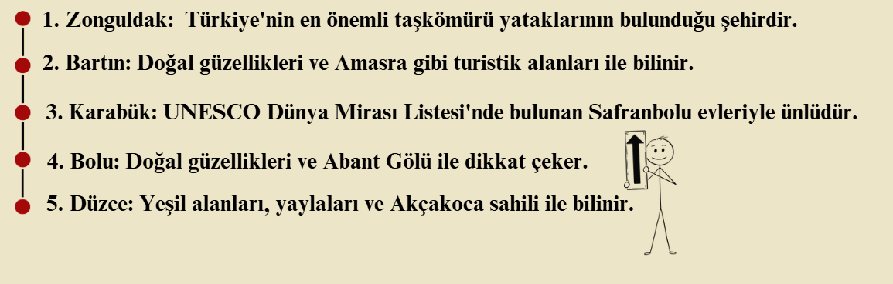
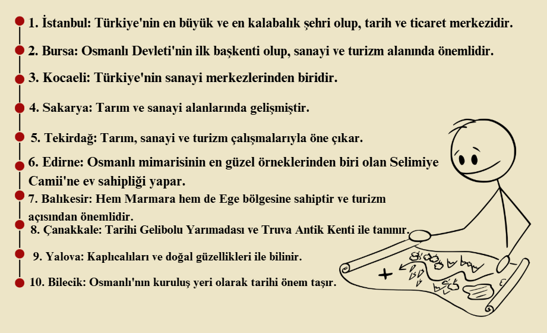
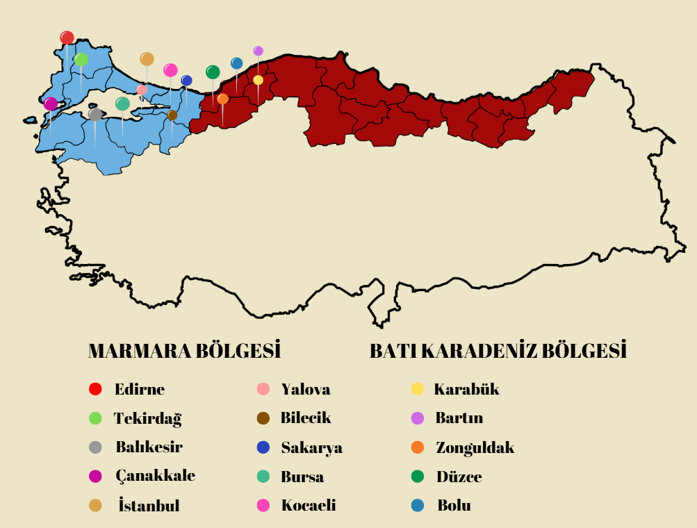
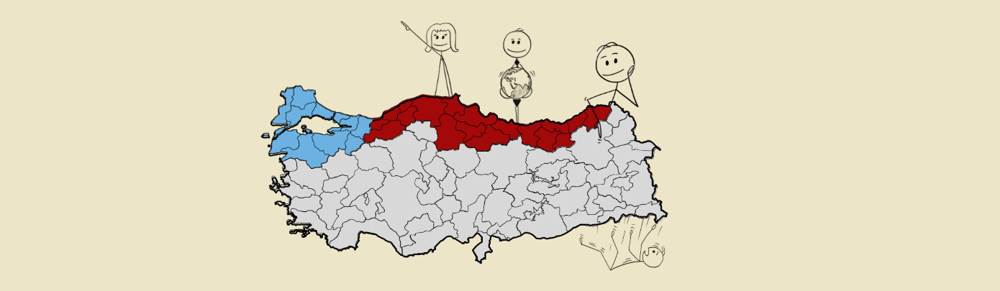

---
title: "SOSYAL MEDYA VE WEB ANALİZİ DERSİ ÖDEV-2"
author: "Çiğdem UÇAR"
date: "2025-03-12"
output:
  html_document: default
  word_document: default
  pdf_document:
    latex_engine: xelatex
always_allow_html: true
---

<style>
/* Arka plan resmi için CSS */
body {
  background-image: url('4.png'); /* Resim URL'si */
  background-size: cover; /* Resmin tüm sayfayı kaplamasını sağlar */
  background-repeat: no-repeat; /* Resmin tekrarlanmasını engeller */
  background-attachment: fixed; /* Resmin sabit kalmasını sağlar */
  color: white; /* Metin rengini beyaz yapar (isteğe bağlı) */
}
</style>


```{r}
Sys.getlocale()
```

```{r setup, include=FALSE}
knitr::opts_chunk$set(echo = TRUE)
Sys.setlocale("LC_ALL", "tr_TR.UTF-8")


```


```{r include_css, echo=FALSE, results="asis"}
cat("\n<style>\n  body {\n    background-color: #ede5c7; /* Koyu krem arka plan */\n    color: black; /* Yazi rengi siyah */\n  }\n  h1, h2, h3, h4 {\n    color: #a30909; /* Basliklari kirmizi rengi yap */\n  }\n  h4 {\n    color: #4f7f9b; /* Basliklari kirmizi rengi yap */\n  }\n  .main-container {\n    background-color: #ede5c7 !important;\n  }\n  /* Grafiklerin arka planini degistir */\n  .plot-container {\n    background-color: #ede5c7 !important;\n    max-width: 80% !important; /* Grafiklerin genisligini sinirla */\n    margin: 0 auto !important; /* Grafikleri ortala */\n  }\n  /* ggplot grafiklerinin panel arka plani */\n  .ggplot-panel {\n    background-color: #ede5c7 !important;\n  }\n  /* R kodlarinin arka plani */\n  pre.r, code.r {\n    background-color: #f5eed5 !important;\n    font-size: 85% !important; /* Kod yazi boyutunu kucult */\n    max-height: 300px !important; /* Maksimum yukseklik */\n    overflow-y: auto !important; /* Icerik sigmazsa kaydirma cubugu */\n  }\n  /* Kod ciktilarinin arka plani - ŞEFFAF YAP */\n  pre:not(.r), code:not(.r) {\n    background-color: transparent !important;\n    font-size: 85% !important;\n    max-height: 300px !important;\n    overflow-y: auto !important;\n  }\n  /* Tablolar icin arka plan ve boyut */\n  table, th, td {\n    background-color: #f5eed5 !important;\n    font-size: 90% !important; /* Tablo yazi boyutunu kucult */\n  }\n  /* Kod bloklari icin ozel stillendirme */\n  .sourceCode {\n    max-height: 250px !important;\n    overflow-y: auto !important;\n  }\n</style>\n")
```


# **BATI KARADENİZ VE MARMARA BÖLGELERİNDEKİ İLLERİN İLİŞKİSİ**

Çalışmamın içeriği Türkiye'de bulunan Batı Karadeniz ve Marmara bölgelerinde ki
illerin arasındaki ilişkilerini gözlemlemektir. İlk çalışmamda iller arasında 
bir sosyal ağ analizi yaptım ve illerin enlem boylam bilgilerini giren kodu oluşturdum.
Şimdiki çalışmamda ise yapacağım adımlar şu şekilde izlenecektir.

## İÇİNDEKİLER

- ***BATI KARADENİZ VE MARMARA BÖLGELERİNDE BULUNAN İLLER ***
- ***TÜRKİYE HARİTASI ÜZERİNDE İLLERİN GÖSTERİMİ***
- ***BATI KARADENİZ VE MARMARA BÖLGELERİNDE Kİ İLLERİN SOSYAL AĞ ANALİZİ ***
- ***İLLERİN DEMOGRAFİK BİLGİLERİ VE GRAFİKLERİ***

Çalışmam bu balşlıklar altında devam edecektir. 


### ***BATI KARADENİZ VE MARMARA BÖLGELERİNDE BULUNAN İLLER ***

Türkiye, yedi coğrafi bölgeden oluşan geniş bir coğrafyaya sahiptir. Bu bölgelerden ikisi olan Batı Karadeniz ve Marmara Bölgesi, hem ekonomik hem de kültürel açıdan büyük bir öneme sahiptir. Bu yazıda, bu iki bölgede bulunan iller ve bu illerin genel özellikleri ele alınacaktır.


####  *[ 📌Batı Karadeniz Bölgesinde Bulunan İller]{.ul}*

Batı Karadeniz, Karadeniz Bölgesi'nin batısında yer alan bölümüdür. Ormanlık alanları, dağları, yaylaları ve sahil şeridiyle dikkat çeker. Batı Karadeniz bölgesinde bulunan iller şunlardır:


```{r, echo=FALSE}


```


####  *[ 📌Marmara Bölgesinde Bulunan İller]{.ul}*

Marmara Bölgesi, Türkiye'nin en batısında yer alan ve en yoğun nüfusa sahip olan bölgesidir. Sanayi, ticaret ve turizm alanlarında önemli bir yere sahiptir. Marmara Bölgesi'nde bulunan iller şunlardır:

```{r, echo=FALSE}

```

Batı Karadeniz ve Marmara Bölgesi, Türkiye'nin hem doğal hem de ekonomik bakımdan en önemli iki bölgesidir. Batı Karadeniz, doğal güzellikleri, ormanları ve denizi ile öne çıkarken; Marmara Bölgesi, sanayi ve ticaretin kalbi olarak büyük bir ekonomik merkez konumundadır. Bu iki bölge, Türkiye'nin kalkınmasında çok önemli bir role sahiptir.


### ***TÜRKİYE HARİTASI ÜZERİNDE İLLERİN GÖSTERİMİ***


```{r, echo=FALSE}

```


### ***BATI KARADENİZ VE MARMARA BÖLGELERİNDE Kİ İLLERİN SOSYAL AĞ ANALİZİ ***

Blogumun başında bahsettiğim ilk calismam sosyal ag analizi uzerineydi. Calismamın 
amaci Türkiye'de bulunan 7 bölgeden 2 tanesinin (Marmara ve Batı karadeniz) illerinin
arasındaki sosyal ağ analiziydi. Sizlere çalismamda kullandigim 
kodların guncellenmis ve değiştirilmiş halleriyle neler yapılabileceğini göstereceğim. 


*↪ İlk olarak çalışma yapacağımız konuda kullanacağımız gerekli kütüphaneleri indirmeliyiz.*

```{r}

library(igraph)
library(visNetwork)
library(ggplot2)


```


*↪ Daha sonra ağ verimizi tanımlamamız gerekiyor. Bunun için veri seti çekebilir ya da manuel olarak*
*girebiliriz. Ben manuel olarak bağlantılı şehirlerimi tanımlayıp kenar listesi oluşturdum. İşte ↷*


```{r}
# Kenar listesi (Şehirler arası bağlantılar)
edges <- c("Bolu","Duzce", "Bolu","Karabuk", "Bolu","Bartin", "Bolu","Zonguldak", "Bolu","Kastamonu",
           "Duzce","Bolu", "Duzce","Karabuk", "Duzce","Bartin", "Duzce","Zonguldak", "Duzce","Kastamonu",
           "Karabuk","Bolu", "Karabuk","Duzce", "Karabuk","Bartin", "Karabuk","Zonguldak", "Karabuk","Kastamonu",
           "Bartin","Bolu", "Bartin","Duzce", "Bartin","Karabuk", "Bartin","Zonguldak", "Bartin","Kastamonu",
           "Zonguldak","Bolu", "Zonguldak","Duzce", "Zonguldak","Karabuk", "Zonguldak","Bartin", "Zonguldak","Kastamonu",
           "Kastamonu","Bolu", "Kastamonu","Duzce", "Kastamonu","Karabuk", "Kastamonu","Bartin", "Kastamonu","Zonguldak")

# Kenar listesini kullanarak ağ grafiğini oluştur
g <- graph_from_edgelist(matrix(edges, ncol = 2, byrow = TRUE), directed = FALSE)

# Düğümlere rastgele koordinatlar atama
set.seed(42)
V(g)$latitude <- runif(vcount(g), 40, 42)
V(g)$longitude <- runif(vcount(g), 27, 30)

# Düğümlere isim verme
V(g)$name <- as.character(V(g))

```


Oluşturduğumuz ağ verilerini grafik çizmek için aşağıdaki kodu kullanıyoruz. Ortaya temel ağ grafiği çıkacaktır. Grafiğin düğümleri bordo, kenarlar mavi renkte olacaktır.
```{r}

# Görselleştirme için düğüm ve kenar renkleri
node_colors <- rep("#a30909", vcount(g))  
edge_colors <- rep("blue", ecount(g))  
node_frame_colors <- rep("orange", vcount(g))  

# Ağın görselleştirilmesi
plot(g, edge.arrow.size = 13, vertex.color = node_colors, vertex.size = 50, 
     vertex.frame.color = node_frame_colors, vertex.label.color = "black", 
     vertex.label.cex = 1.2, vertex.label.dist = 2, edge.curved = 0.5)

```


- *Bu kod parçası interaktif bir ağ haritası oluşturur ve bazı önemli özellikler içerir:*

`V(g)$name`: Grafikteki her düğümün (şehrin) adıdır.
`label`: Düğümlerin üzerine yazılacak isimler belirlenir.
`lat` ve `lon`: Düğümlerin koordinat bilgileri (haritada yerleştirmek için)dir.
`color = "#a30909"`: Düğümlerin varsayılan rengi bordo olarak ayarlanmıştır.
`size = 10`: Düğümlerin boyutu 10 punto olarak ayarlanmıştır.

`visNetwork(nodes, edges)` → nodes ve edges kullanarak ağı oluşturur.
`visNodes(size = 15, shape` = "dot", color = "purple") → Düğümleri mor renkte ve dot (nokta) şeklinde çizer.
`visEdges(color = "grey")` → Kenarları gri renkte gösterir.
`visOptions(highlightNearest` = TRUE, nodesIdSelection = TRUE)
`highlightNearest` = TRUE: Bir düğüme tıkladığında, ona bağlı olan tüm düğümleri vurgular.
`nodesIdSelection` = TRUE: Düğümleri isimlerine göre seçmeyi sağlar (filtreleme özelliği ekler).
`visLayout(randomSeed = 42`, improvedLayout = TRUE)
`randomSeed = 42`: Haritanın her çalıştırmada aynı şekilde düzenlenmesini sağlar bir önceki ağ görselleştirmesinde kullanmadığım için her çalıştırmamda farktı şekilde düzenlenmektedir.
`improvedLayout `= TRUE: Daha düzenli bir görselleştirme sağlar.


```{r}
# Düğümleri içeren veri çerçevesi
nodes <- data.frame(
  id = V(g)$name, 
  label = V(g)$name, 
  lat = V(g)$latitude,  
  lon = V(g)$longitude,
  color = "#a30909",
  size = 10
)

# Kenarları içeren veri çerçevesi
edges <- get.data.frame(g)

# Ağ haritası
visNetwork(nodes, edges) %>%
  visNodes(size = 15, shape = "dot", color = "purple") %>%
  visEdges(color = "grey") %>%
  visOptions(highlightNearest = TRUE, nodesIdSelection = TRUE) %>%
  visLayout(randomSeed = 42, improvedLayout = TRUE)

```


Yaptığım ilk çalışmamın kısaca özetleyerek bilgilendirdim. şimdi ise yeni çalışmam hakkında bilgilendireceğim.


### ***İLLERİN NÜFUS BİLGİLERİ VE GRAFİKLERİ***

İlk çalışmamda Batı karadeniz ve Marmara bölgelerinde bulunan şehirlerin sosyal ağ analizlerini ele almıştım. Şimdi ise bu şehirler üzerinde son 5 yıl da Nüfus, yaş oranı, cinsiyet oranı gibi konularında değişiklikleri grafikler üzerinden inceleyeceğiz.


```{r}
library(tidyverse)
library(ggplot2)
library(scales)
library(knitr)
```


## Marmara ve Batı Karadeniz İlleri Nüfus Verileri (2019-2024)

Bu kod blogunda, Marmara ve Batı Karadeniz bölgesindeki illerin 2019-2024 yılları arasındaki nüfus bilgilerini girerek görselleştirdik yani tablo şeklinde bir çıktı alarak belirtilen şehirlerin yıl ve nüfuslarını görmekteyiz.

```{r veri-girisi}
# Nüfus verileri (TÜİK verilerinden örnek olarak alınmıştır)
# Gerçek projenizde güncel ve doğru verileri kullanmalısınız

nufus_verileri <- data.frame(
  il = c("Istanbul", "Bursa", "Kocaeli", "Sakarya", "Tekirdag", 
         "Zonguldak", "Bartin", "Karabuk", "Bolu", "Duzce"),
  
  y2019 = c(15519267, 3056120, 1953035, 1029650, 1081065,
            596892, 198999, 248014, 316126, 387844),
  
  y2020 = c(15462452, 3101833, 1997258, 1042649, 1113400,
            591204, 198979, 244453, 316126, 395679),
  
  y2021 = c(15840900, 3147818, 2033441, 1060876, 1142451,
            587684, 201711, 242347, 320014, 400976),
  
  y2022 = c(15907951, 3194720, 2079072, 1075420, 1142552,
            581104, 201061, 240374, 320824, 405106),
  
  y2023 = c(16041602, 3248680, 2122730, 1099631, 1176587,
            576758, 201293, 239597, 322941, 408623),
  
  y2024 = c(16115795, 3293513, 2159306, 1116925, 1201543,
            572146, 201508, 238419, 325067, 411249)
)

# Verileri uzun formata dönüştürme
nufus_uzun <- nufus_verileri %>%
  pivot_longer(
    cols = starts_with("y"),
    names_to = "yil",
    values_to = "nufus"
  ) %>%
  mutate(yil = as.integer(str_replace(yil, "y", "")))

# Verileri kontrol etme
nufus_uzun
```

## 📈 Tüm İllerin Nüfus Grafiği

Burada iki bölgeye ait tüm illerin nüfus değişimini gösteren çizgi grafiğini elde etmek amaçlanmıştır.

```{r tum-iller-grafik, fig.width=10, fig.height=6}

# Tüm illerin nüfus değişimini gösteren çizgi grafiği
ggplot(nufus_uzun, aes(x = yil, y = nufus, color = il, group = il)) +
  geom_line(linewidth = 1) +
  geom_point(size = 2) +
  scale_y_continuous(labels = label_comma()) +
  scale_x_continuous(breaks = 2019:2024) +
  labs(
    title = "Marmara ve Bati Karadeniz Illeri Nufus Degisimi (2019-2024)",
    subtitle = "TUIK verileri baz alinmistir",
    x = "Yil",
    y = "Nufus",
    color = "Il"
  ) +
  theme_minimal() +
  theme(
    legend.position = "right",
    plot.title = element_text(face = "bold"),
    axis.text.x = element_text(angle = 0)
  )
```

Çizgi grafiğini incelediğimizde ⇑ İstanbul'un nüfusu diğer illere göre çok yüksek olduğundan, grafikte diğer illerin değişimini görmekte zorlanıyoruz. Bu nedenle, aşağıda İstanbul hariç diğer illerin nüfus değişimini gösteren çizgi grafiğini oluşturdum.

```{r istanbul-haric-grafik, fig.width=10, fig.height=6}

nufus_uzun %>%
  filter(il != "Istanbul") %>%
  ggplot(aes(x = yil, y = nufus, color = il, group = il)) +
  geom_line(linewidth = 1) +
  geom_point(size = 2) +
  scale_y_continuous(labels = label_comma()) +
  scale_x_continuous(breaks = 2019:2024) +
  labs(
    title = "Marmara ve Bati Karadeniz Illeri Nufus Degisimi (2019-2024)",
    subtitle = "Istanbul haric",
    x = "Yil",
    y = "Nufus",
    color = "Il"
  ) +
  theme_minimal() +
  theme(
    legend.position = "right",
    plot.title = element_text(face = "bold"),
    axis.text.x = element_text(angle = 0)
  )
```

## 📈 Yüzdesel Değişim Grafiği

Her ilin 2019'dan 2024'e kadar olan yüzdesel değişimini çizgisel grafikte değil de nokta grafiğinde görelim:

```{r yuzdesel-degisim, fig.width=10, fig.height=6}
yuzdesel_degisim <- nufus_uzun %>%
  group_by(il) %>%
  mutate(
    baz_yil = first(nufus),
    yuzde_degisim = (nufus / baz_yil - 1) * 100
  )

ggplot(yuzdesel_degisim, aes(x = yil, y = yuzde_degisim, color = il, group = il)) +
  geom_point(size = 3, alpha = 0.8) +  
  geom_line(linetype = "dotted", linewidth = 0.5, alpha = 0.6) +
  scale_y_continuous(labels = function(x) paste0(x, "%")) +
  scale_x_continuous(breaks = 2019:2024) +
  labs(
    title = "Marmara ve Batı Karadeniz İlleri Nüfus Değişim Oranı (2019-2024)",
    subtitle = "2019 baz yıl olarak alınmıştır",
    x = "Yıl",
    y = "Değişim Oranı (%)",
    color = "İl"
  ) +
  
  theme(
    legend.position = "right",
    plot.title = element_text(face = "bold"),
    axis.text.x = element_text(angle = 0)
  )
```

Çıktısını aldığım nokta grafiğinde illerin yıllar bazındaki değişimlerini detaylı bir şekilde incelemekteyiz.


## Nüfus Verileri Tablosu

Burada belirtmiş olduğum tabloda yukarıdaki verileri çekerek aşağıdaki kod bloğuyla satır sütün şeklinde bir tablo oluşturdum. 


```{r nufus-tablosu}
# Nüfus verileri tablosu
nufus_verileri %>%
  kable(
    caption = "Marmara ve Batı Karadeniz İlleri Nüfus Verileri (2019-2024)",
    format.args = list(big.mark = ".", decimal.mark = ","),
    col.names = c("İl", "2019", "2020", "2021", "2022", "2023", "2024")
  )
```

Çıktısı olan tabloyu kodlarla oluşturduğumu belirtmiştim. Bir de manuel olarak aynı tabloyu oluşturacağım. 


| İl        |       2019 |     2020  |      2021 |      2022 |       2023|      2024 |
:-----------|-----------:|----------:|----------:|----------:|----------:|---------- |
| İstanbul  | 15.519.267 |15.462.452 |15.840.900 | 15.907.951| 16.041.602|16.115.795 |
:-----------|-----------:|----------:|----------:|----------:|----------:|---------- |
| Bursa     |  3.056.120 | 3.101.833 | 3.147.818 | 3.194.720 | 3.248.680 | 3.293.513 |
:-----------|-----------:|----------:|----------:|----------:|----------:|---------- |
| Kocaeli   |  1.953.035 | 1.997.258 | 2.033.441 | 2.079.072 | 2.122.730 | 2.159.306 |
:-----------|-----------:|----------:|----------:|----------:|----------:|---------- |
| Sakarya   |  1.029.650 | 1.042.649 | 1.060.876 | 1.075.420 | 1.099.631 | 1.116.925 |
:-----------|-----------:|----------:|----------:|----------:|----------:|---------- |
| Tekirdağ  |  1.081.065 | 1.113.400 | 1.142.451 | 1.142.552 | 1.176.587 | 1.201.543 |
:-----------|-----------:|----------:|----------:|----------:|----------:|---------- |
| Zonguldak |    596.892 |   591.204 |   587.684 |   581.104 |   576.758 |   572.146 |
:-----------|-----------:|----------:|----------:|----------:|----------:|---------- |
| Bartın    |    198.999 |   198.979 |   201.711 |   201.061 |   201.293 |   201.508 |
:-----------|-----------:|----------:|----------:|----------:|----------:|---------- |
| Karabük   |    248.014 |   244.453 |   242.347 |   240.374 |   239.597 |   238.419 |
:-----------|-----------:|----------:|----------:|----------:|----------:|---------- |
| Bolu      |    316.126 |   316.126 |   320.014 |   320.824 |   322.941 |   325.067 |
:-----------|-----------:|----------:|----------:|----------:|----------:|---------- |
| Düzce     |    387.844 |   395.679 |   400.976 |   405.106 |   408.623 |   411.249 |


Bu grafikler ve tablolar, Marmara ve Batı Karadeniz bölgesindeki illerin 2019-2024 yılları arasındaki nüfus değişimini göstermektedir. Görüldüğü üzere, Marmara bölgesindeki illerin çoğu artış gösterirken, Batı Karadeniz bölgesindeki bazı illerde azalma eğilimi görülmektedir.


## Marmara ve Batı Karadeniz İlleri Yaş Dağılımı (2024)

Bu dokümanda, Marmara ve Batı Karadeniz bölgesindeki illerin yaş dağılımı pasta grafikleri ile görselleştirilmiştir.

```{r veri-girisi-2}

yas_verileri <- data.frame(
  il = c("Istanbul", "Bursa", "Kocaeli", "Sakarya", "Tekirdag", 
         "Zonguldak", "Bartin", "Karabuk", "Bolu", "Duzce"),
  
  yas_0_14 = c(23.5, 22.3, 23.1, 22.8, 21.5,
               18.2, 17.5, 17.3, 18.1, 21.2),
  
  yas_15_24 = c(15.8, 15.2, 15.7, 15.3, 15.0,
                13.5, 13.2, 12.7, 14.0, 15.3),
  
  yas_25_44 = c(34.2, 32.8, 33.1, 31.7, 32.5,
                29.2, 27.5, 27.3, 28.4, 30.2),
  
  yas_45_64 = c(19.7, 21.3, 20.5, 21.4, 22.5,
                25.3, 26.5, 26.7, 25.2, 22.8),
  
  yas_65_ustu = c(6.8, 8.4, 7.6, 8.8, 8.5,
                  13.8, 15.3, 16.0, 14.3, 10.5)
)

# Verileri uzun formata donusturme
yas_uzun <- yas_verileri %>%
  pivot_longer(
    cols = starts_with("yas_"),
    names_to = "yas_grubu",
    values_to = "yuzde"
  ) %>%
  mutate(
    yas_grubu = case_when(
      yas_grubu == "yas_0_14" ~ "0-14 Yas",
      yas_grubu == "yas_15_24" ~ "15-24 Yas",
      yas_grubu == "yas_25_44" ~ "25-44 Yas",
      yas_grubu == "yas_45_64" ~ "45-64 Yas",
      yas_grubu == "yas_65_ustu" ~ "65+ Yas"
    )
  )

# Verileri kontrol etme
head(yas_uzun)
```

## İller İçin Pasta Grafikleri
Her il için ayrı bir pasta grafiği oluşturarak illerin yaş dağılımlarını incelemeyi amaçladım.

```{r pasta-grafikleri, fig.width=8, fig.height=6, out.width="80%", fig.align="center"}

yas_renkleri <- c("0-14 Yas" = "#a20a0a", 
                 "15-24 Yas" = "#ffde59", 
                 "25-44 Yas" = "#8da0cb", 
                 "45-64 Yas" = "#e78ac3", 
                 "65+ Yas" = "#ade196")


ggplot(yas_uzun, aes(x = "", y = yuzde, fill = yas_grubu)) +
  geom_bar(stat = "identity", width = 1) +
  coord_polar("y", start = 0) +
  scale_fill_manual(values = yas_renkleri) +
  labs(
    title = "Marmara ve Bati Karadeniz Illerinin Yas Dagilimi (2024)",
    fill = "Yas Grubu"
  ) +
  theme_void() +
  theme(
    legend.position = "bottom",
    plot.title = element_text(hjust = 0.5, face = "bold"),
    strip.text = element_text(size = 12, face = "bold")
  ) +
  facet_wrap(~ il, ncol = 3)
```

##  Her İl İçin Ayrı Pasta Grafikleri

Bu kodu kullanarak istediğimiz şehir için detaylı bir şekilde pasta grafiğini görebiliriz. İşte seçili iller için daha detaylı grafikleri görelim:

```{r secili-iller-pasta, fig.width=10, fig.height=6}
# Secili iller (Marmara'dan ve Bati Karadeniz'den ornekler)
secili_iller <- c("Istanbul", "Bursa", "Kocaeli", "Duzce")

# Secili iller icin pasta grafigi olusturma
yas_uzun %>%
  filter(il %in% secili_iller) %>%
  ggplot(aes(x = "", y = yuzde, fill = yas_grubu)) +
  geom_bar(stat = "identity", width = 1) +
  coord_polar("y", start = 0) +
  scale_fill_manual(values = yas_renkleri) +
  labs(
    title = "Secili Illerin Yas Dagilimi (2024)",
    fill = "Yas Grubu"
  ) +
  geom_text(aes(label = paste0(round(yuzde, 1), "%")), 
            position = position_stack(vjust = 0.5)) +
  theme_void() +
  theme(
    legend.position = "bottom",
    plot.title = element_text(hjust = 0.5, face = "bold"),
    strip.text = element_text(size = 12, face = "bold")
  ) +
  facet_wrap(~ il, ncol = 2)
```


Bu grafikler ve tablolar, Marmara ve Batı Karadeniz bölgesindeki illerin yaş dağılımını göstermektedir. Görüldüğü üzere, Marmara bölgesindeki illerde genç nüfus (0-24 yaş) oranı daha yüksekken, Batı Karadeniz bölgesindeki illerde yaşlı nüfus (65+ yaş) oranı daha fazladır.


##  ♂️♀️ Marmara ve Batı Karadeniz İlleri Cinsiyet Verileri (2019-2024)

Marmara ve Batı Karadeniz illeri cinsiyet analizi yapmak için verilere ihtiyacımız vardı bunu da rastgele sayılardan elde ettim. 
```{r}
# Şehirler listesi
sehirler <- c("Istanbul", "Bursa", "Kocaeli", "Sakarya", "Tekirdag", 
              "Zonguldak", "Bartin", "Karabuk", "Bolu", "Duzce")

# Yıllar
yillar <- 2019:2024

# Veriyi oluştur
set.seed(123) # Rastgele sayılar için sabit bir seed değeri
veri <- expand.grid(il = sehirler, yil = yillar, cinsiyet = c("Erkek", "Kadin")) %>%
  mutate(sayi = round(runif(n(), 500000, 2000000))) # Rastgele kişi sayısı oluştur

veri
```


## Marmara ve Batı Karadeniz de bulunan illerin cinsiyet verilerinin makarna grafiği gösterimi


Her şehir için cinsiyet bazında zaman yerinde değişim gösteren bir makarna grafiği çiziyoruz. Renkleri manuel olarak değiştiriyoruz.

```{r}

renk_paleti <- c("Erkek" = "#8da0cb", "Kadin" = "#a20a0a") # Mavi ve Kırmızı renkler


ggplot(veri, aes(x = yil, y = sayi, color = cinsiyet, group = interaction(il, cinsiyet))) +
  geom_line(size = 0.8, alpha = 0.7) + 
  scale_color_manual(values = renk_paleti) + 
  facet_wrap(~ il, ncol = 3) + 
  labs(title = "2019-2024 Cinsiyet Dağılımı (Makarna Grafiği)",
       x = "Yıl",
       y = "Kişi Sayısı",
       color = "Cinsiyet") +
  theme_minimal() +
  theme(axis.text.x = element_text(angle = 45, hjust = 1)) # X eksenindeki yıl etiketlerini döndür
```


## Yoğunluk haritası


```{r setup1, include=FALSE}
knitr::opts_chunk$set(echo = TRUE)
```

```{r}
library(ggplot2)
library(dplyr)
library(tidyr) # Veriyi pivot yapmak için
```


```{r}
# Şehirler listesi
sehirler <- c("Istanbul", "Bursa", "Kocaeli", "Sakarya", "Tekirdag", 
              "Zonguldak", "Bartin", "Karabuk", "Bolu", "Duzce")

# Yıllar
yillar <- 2019:2024

# Veriyi oluştur
set.seed(123) # Rastgele sayılar için sabit bir seed değeri
veri <- expand.grid(il = sehirler, yil = yillar, cinsiyet = c("Erkek", "Kadin")) %>%
  mutate(sayi = round(runif(n(), 500000, 2000000))) # Rastgele kişi sayısı oluştur

# Veriyi görüntüle
head(veri)
```


```{r}
# Veriyi pivot yap (wide format)
veri_wide <- veri %>%
  pivot_wider(names_from = cinsiyet, values_from = sayi)

# Veriyi görüntüle
head(veri_wide)
```


yukarıda oluşturduğumuz kodlar kadın ve erkek oranlarını tablolaştırmamızda işimize yaradı. Şimdi ise elde ettiğimiz verileri yoğunluk haritasında göreceğiz. 

#### Erkek Cinsiyet Yoğunluk Haritası


```{r}
# Yoğunluk haritasını çiz
ggplot(veri_wide, aes(x = yil, y = il, fill = Erkek)) +
  geom_tile(color = "white", size = 0.1) + # Kafeslerin kenarlarını beyaz yap
  scale_fill_gradient(low = "#f7fbff", high = "#08306b") + # Renk skalası
  labs(title = "Erkek Cinsiyet Yoğunluk Haritası",
       x = "Yıl",
       y = "Şehir",
       fill = "Kişi Sayısı") +
  theme_minimal() +
  theme(axis.text.x = element_text(angle = 45, hjust = 1)) # X eksenindeki yıl etiketlerini döndür
```

#### Kadın Cinsiyet Yoğunluk Haritası

```{r}
# Kadın için yoğunluk haritasını çiz
ggplot(veri_wide, aes(x = yil, y = il, fill = Kadin)) +
  geom_tile(color = "white", size = 0.1) + # Kafeslerin kenarlarını beyaz yap
  scale_fill_gradient(low = "#fff5f0", high = "#67000d") + # Renk skalası
  labs(title = "Kadın Cinsiyet Yoğunluk Haritası",
       x = "Yıl",
       y = "Şehir",
       fill = "Kişi Sayısı") +
  theme_minimal() +
  theme(axis.text.x = element_text(angle = 45, hjust = 1)) # X eksenindeki yıl etiketlerini döndür
```


## kelime bulutu

Ek olarak Batı Karadeniz ve Marmara bölgelerinde baz aldığımız illeri içeren bir kelime bulutu oluşturdum. 


⇓⇓⇓⇓⇓⇓⇓⇓⇓⇓⇓⇓⇓⇓⇓⇓⇓⇓⇓⇓⇓⇓⇓⇓⇓⇓⇓⇓

```{r}
library(ggwordcloud)
library(ggplot2)
library(showtext)
library(RColorBrewer)
```


```{r}
# Karadeniz Bölgesi şehirleri
karadeniz_sehirleri <- c("Bartın", "Bolu", "Düzce", "Karabük", "Kastamonu", "Zonguldak")

# Marmara Bölgesi şehirleri
marmara_sehirleri <- c("Balıkesir", "Bilecik", "Bursa", "Çanakkale", "Edirne", "İstanbul",
                        "Kırklareli", "Kocaeli", "Sakarya", "Tekirdağ", "Yalova")

# Tüm şehirleri birleştir
tum_sehirler <- c(karadeniz_sehirleri, marmara_sehirleri)

# Şehirlerin kelime sıklığını rastgele belirleyelim
set.seed(123)
frekanslar <- sample(10:50, length(tum_sehirler), replace = TRUE)  # 10-50 arası rastgele frekans
renkler <- sample(brewer.pal(8, "Dark2"), length(tum_sehirler), replace = TRUE)  # Rastgele renk seçimi
aci <- sample(seq(-45, 45, by = 15), length(tum_sehirler), replace = TRUE)  # Rastgele açılar

# Veri çerçevesini oluştur
sehir_frekans <- data.frame(
  Sehir = tum_sehirler,
  Frekans = frekanslar,
  Renk = renkler,
  Aci = aci
)

# Veriyi kontrol edelim
print(sehir_frekans)
```


```{r}
# Türkçe fontları ekleyelim
font_add_google("Open Sans", "opensans")
showtext_auto()
```


```{r}
ggplot(sehir_frekans, aes(label = Sehir, size = Frekans, color = Renk, angle = Aci)) +
  geom_text_wordcloud(family = "opensans", fontface = "bold") +  # Türkçe destekli font
  scale_size_area(max_size = 15) +  # Kelime boyutlarını belirle
  scale_color_identity() +  # Renkleri doğrudan kullan
  theme_minimal() +
  ggtitle("Batı Karadeniz ve Marmara Şehirleri Kelime Bulutu") +
  theme(plot.title = element_text(size = 16, face = "bold"))
```


```{r, echo=FALSE}


```


```{r, echo=FALSE, results='asis'}
cat('<audio controls autoplay preload="auto">
        <source src="videoplayback.m4a" type="audio/mp4">
        Tarayıcınız ses dosyasını desteklemiyor.
      </audio>')

```